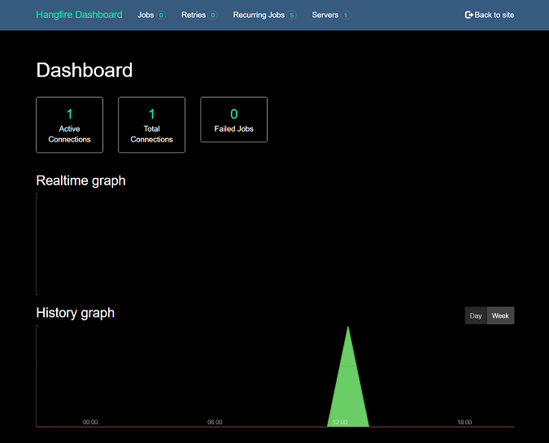
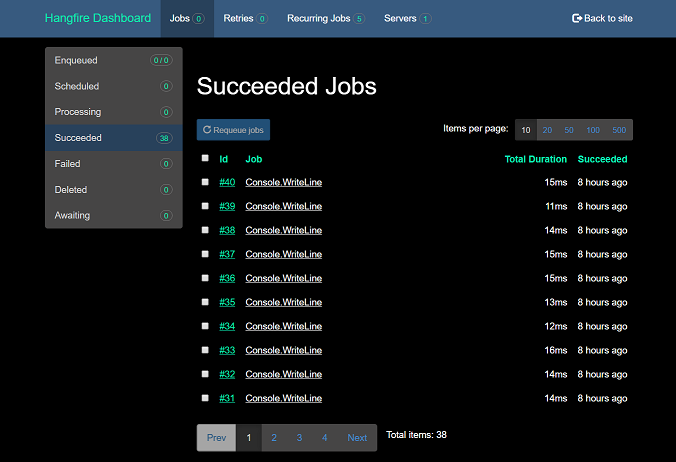

# Hangfire.Dashboard.Dark

[](https://vip32.visualstudio.com/Hangfire.Dashboard.Dark/_build/latest?definitionId=6&branchName=master)
[](https://www.nuget.org/packages/Hangfire.Dashboard.Dark/)

Hangfire.Dashboard.Dark shows the hangfire dashboard in a beautiful dark theme. 

## Features

 - [Darkly](http://bootswatch.com/darkly/)




## Setup

In .NET Core's Startup.cs:
```c#
public void ConfigureServices(IServiceCollection services)
{
    services.AddHangfire(config =>
    {
        ...
        config.UseDarkDashboard();
    });
}
```

Otherwise,
```c#
GlobalConfiguration.Configuration
    ...
    .UseDarkDashboard();
```


